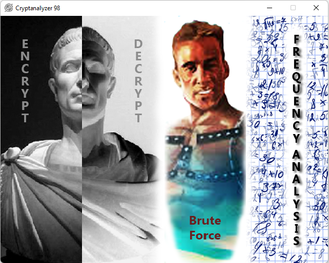
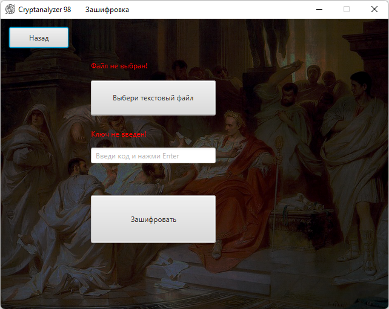
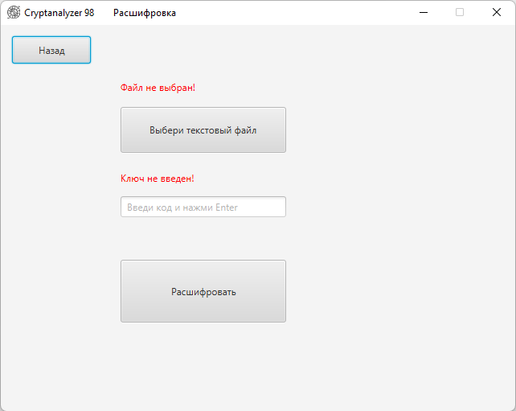
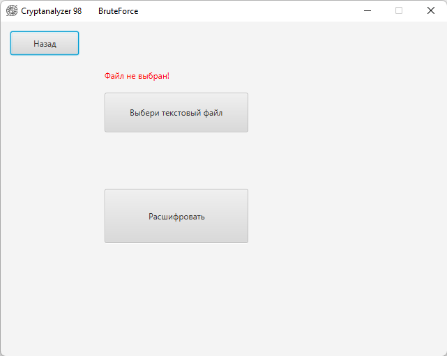
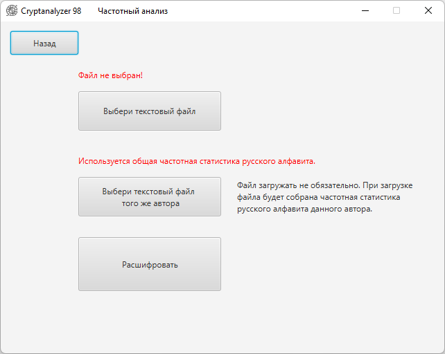

<h1 align="center">Итоговый проект первого модуля JavaRush.</h1>
<h1 align="center">Криптоанализатор.</h1>

#### Владимир Кривко.

#### GitHub: *https://github.com/VladimirKrivko/gui_cryptonalyzer*

#### Менторы: Никита Чертков, Иван Коряковский.

---

## Задача:
&emsp; Написать программу, которая работает с шифром Цезаря.
За основу криптографического алфавита возьми все буквы русского алфавита и знаки пунктуации (. , ”” : - ! ? ПРОБЕЛ).
Если попадаются символы, которые не входят в наш криптографический алфавит, просто пропусти их.

### Обязательные требования.

#### У программы должно быть 2 режима:

    - Шифрование / расшифровка.
&emsp; Программа должна зашифровывать и расшифровывать текст, используя заданный криптографический ключ.
Программа должна получать путь к текстовому файлу с исходным текстом и на его основе создавать файл
с зашифрованным текстом.

	- Криптоанализ методом brute force.
&emsp; Программа должна взламывать зашифрованный текст, переданный в виде текстового файла. Если пользователь
выбирает brute force (брутфорс, поиск грубой силой), программа должна самостоятельно, путем перебора, подобрать ключ
и расшифровать текст. Подумай, какой критерий программа должна воспринимать как сигнал успешного подбора ключа.
Возможно, нужно обратить внимание на пробелы между словами или правильность использования знаков пунктуации.

#### Дополнительные требования(опционально):

    - Криптоанализ методом статистического анализа.
&emsp; У пользователя программы должна быть возможность выбрать один из двух методов криптоанализа. Если пользователь
выбирает метод статистического анализа, ему нужно предложить загрузить еще один дополнительный файл с текстом,
желательно того же автора и той же стилистики. На основе загруженного файла программа должна составить статистику
вхождения символов и после этого попытаться использовать полученную статистику для криптоанализа зашифрованного текста.

    - User Interface.
&emsp; Все диалоговые окна с пользователем делай на свое усмотрение. При желании можно использовать графические
фреймворки Swing, JavaFX. Готовое решение загрузи в публичный Git-репозиторий.

---

## Запуск программы:
_*src/main/java/com/example/gui_cryptonalyzer/MainApplication.java*_

---

## Образцы текстов для тестирования:
##### (просто для удобства, можете использовать любые другие)
_*src/main/resources/TextSample*_

---

## Инструкция по эксплуатации:

<h3 align="center">Главный экран (меню).</h3>

&emsp; Выбор четырех опций, соответствующих заданиям. _**Encrypt**_ - шифровка по ключу. _**Decrypt**_ - расшифровка по ключу.
_**BruteForce**_ - расшифровка без ключа. Frequency _**Analysis**_ - расшифровка методом статистического (частотного) анализа.

<h3 align="center">Encrypt.</h3>

1. Кнопка _**"назад"**_ - выход на главный экран (для всех методов).
2. Кнопка _**"Выбери текстовый файл"**_ - открывает диалоговое окно выбора файлов (для всех методов).
3. Текстовое поле ввода _**"Введи код и нажми ENTER"**_ - для удобства пользователя в поле можно ввести абсолютно любой набор
   букв, цифр, знаков препинания (после ввода не забыть прожать _*ENTER*_). Пользователь ничем не ограничен, можно написать
   что угодно, хоть лбом по клавиатуре ударить (была проведена серия тестов). Метод _*generateEncryptKey(String stringKey)*_
   класса _*Cipher.java*_ нехитрой манипуляцией получит из текста какое-то целое число с которым и будет работать программа.
4. Кнопка _**"Зашифровать"**_ - шифрует Цезарем выбранный текст и сохраняет его в файл рядом с исходным файлом с припиской
   к имени _*"_CRYPT"*_.

<h3 align="center">Decrypt.</h3>

1. Кнопка _**"назад"**_.
2. Кнопка _**"Выбери текстовый файл"**_.
3. Текстовое поле ввода _**"Введи код и нажми ENTER"**_ - необходимо ввести тот же пароль который использовался при
   шифровании данного текста (лучше запомнить пароль который вводили при шифровке, чтобы проверить работу этого метода).
4. Кнопка _**"Расшифровать"**_ - расшифрует Цезарем выбранный текст и сохранит его в файл рядом с исходным файлом с припиской
   к имени _*"_CRYPT"*_.

<h3 align="center">BruteForce.</h3>

1. Кнопка _**"назад"**_.
2. Кнопка _**"Выбери текстовый файл"**_.
3. Кнопка _**"Расшифровать"**_ - расшифрует Цезарем выбранный текст и сохранит его в файл рядом с исходным файлом с припиской
   к имени _*"_CRYPT"*_.
   (Может работать с очень короткими текстами. В одно предложение в несколько слов, можно без запятых.)

<h3 align="center">Frequency Analysis.</h3>

>&emsp; Частотный анализ является одним из методов статистического анализа данных." Лаборатория статистических исследований
Кубанского государственного университета. http://www.statlab.kubsu.ru/node/4)
1. Кнопка _**"назад"**_.
2. Кнопка _**"Выбери текстовый файл"**_.
3. Кнопка _**"Выбери текстовый файл того же автора"**_ - открывает диалоговое окно выбора файла того же автора что и
   зашифрованный текст. 
   - Если не выбирать дополнительный файл, то расшифровка будет произведена согласно общей
   статистике русского языка. Пробел включен в алфавит по условию, значит он занимает первое место по популярности.
   (Где-то вычитал у какого-то лингвиста. Пробел практически для любого языка является самым
   популярным символом.)
   - Если выбрать дополнительный файл, то по его тексту будет собрана частотная статистика вхождения первых 11 самых
   популярных символов, на основе которых будет произведена расшифровка текста. (11 символов потому что дальше разница
   в частоте использования букв минимальная, а значит в теории может привести к ошибочным данным.)
4. Кнопка _**"Расшифровать"**_ - приводит механизм расшифровки в действие. Метод расшифровки данным методом чувствителен
   к объему текста, так как частотную статистику надо собирать с некоторого объема. В коротких же текстах будет своя
   частная частотная статистика, которую сложно предсказать. Но если дополнительно добавить этот же короткий, но
   открытый текст, то метод соберет эту частную недостатистику и расшифрует корректно. В общем текст должен содержать
   около 250 символов (входящих в alphabetRus). Этот средний объем, позволяет расшифровывать небольшие тексты. Возможно
   в будущем я скорректирую свое мнение.

---

## Краткое описание классов:

&emsp; Все классы относящиеся непосредственно к логике задачи, находятся в отдельном пакете _**"src/main/java/com/example/logics/"**_. 

### public class AlphabetCaesar
&emsp; Класс _**AlphabetCaesar**_ содержит алфавит по которому будет производиться шифрование методом Цезаря. В будущем хочу
посредством этого класса добавить функцию смены алфавита шифрования путем выбора из предустановленных, либо создания
пользовательского алфавита.

### public class IOTextFile
&emsp; Класс _**IOTextFile**_ утилитарный, служит для получения текста из файла и сохранения текста в новый файл. Во время
подбора названия этому классу я руководствовался исчерпанной фантазией (по-прежнему не вернулась).

### class GenerateKey
&emsp; Класс _**GenerateKey**_ описывает преобразование строки к целочисленному значению. Т.е. чтобы пользовательский ввод
строкового пароля шифрования внутри классов _**Encrypt**_ и _**Decrypt**_ преобразовался в целочисленное значение,
которым и будет в конечном итоге шифроваться текст. Содержит единственный метод _**int generateEncryptKey(String password)**_.
Объекты этого класса используются конструкторами классов _**Encrypt**_ и _**Decrypt**_, чтобы скрыть реализацию преобразования строки
в число и не плодить дублирующийся код.

### public class Encrypt
&emsp; Класс _**Encrypt**_ выполняет шифрование текста по целочисленному значению.

### public class Decrypt
&emsp; Класс _**Decrypt**_ выполняет дешифрование текста по целочисленному значению. Класс включает в себя объект класса
_**Encrypt**_, которому в конструктор передается параметром ключ дешифровки. Т.е. пользователь для расшифровки вводит тот же
текстовый пароль, который преобразуется в число со знаком _**"-"**_ (минус).

### public class BruteForce
&emsp; Класс _**BruteForce**_ описывает дешифрование текста перебирая все возможные варианты ключей и подсчитывая максимальное
количество вхождений в текст _**" "**_ (пробелов) и _**", "**_ (запятая пробел).

### public class StaticAnalysis
&emsp; Класс _**StaticAnalysis**_ дешифрует текст статистическим анализом, а именно с применением метода частотного анализа.
Если мы не добавляем открытый текст того же автора, то используется общая частотная статистика русского алфавита, а именно
первые 11 символов _**" оеаинтсрвл"**_. Далее находим первые 11 символов в порядке убывания популярности в закрытом тексте.
И проверяем при каком ключе первый шифросимвол станет первым символом массива общей частотной статистики русского алфавита.
Полученное значение ключа, при каждой итерации заносим в отдельный массив (int []). Затем находим самый часто повторяющийся
ключ. Создаем объект _**Encrypt**_ и передаем в него параметрами _**закрытый текст**_ и _**ключ**_ (int). _(Для этого мне и понадобился
отдельный конструктор в классе Encrypt!)_ Вызываем у новосозданного объекта метод _**decrypt()**_.
&emsp; Если мы добавляем еще открытый текст того же автора, то по нему собирается статистика самых популярных 11 символов.
Затем полученный массив записывается в переменную, которая ранее ссылалась на общую частотную статистику русского алфавита.
Остальной механизм дешифрования работает без изменений.

---

&emsp; Графический интерфейс для меня тема новая, сделал как смог. В дальнейшем скорее всего перепишу его на более симпатичный вариант :)

&emsp; _**П.С.**_ при вводе ключа не забывайте нажимать _*ENTER*_.

<h2 align="center"> Спасибо за внимание! </h2>

